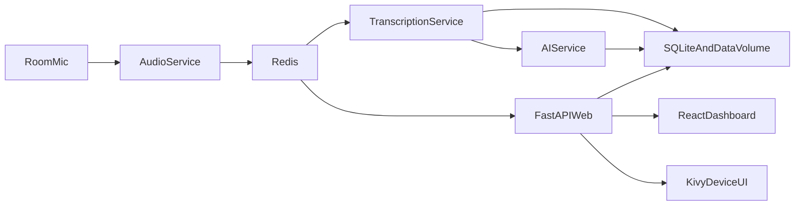
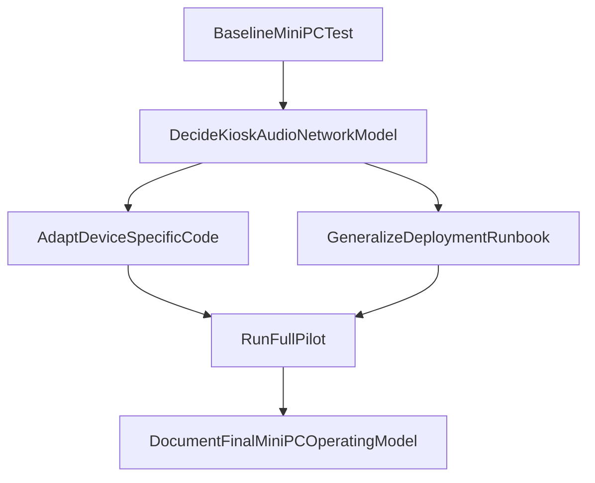

# MeetingBox Handover

Last updated: 2026-03-16

## Purpose
This document is a repo-backed handover for the current `MeetingBox` project state. It summarizes what has been built so far, what appears to be working today, where the system is still tied to Raspberry Pi assumptions, and the recommended next steps for the move to a Linux kiosk mini PC with a built-in screen and microphone.

This handover is based only on repository evidence, primarily:

- `README.md`
- `DEPLOY_LINUX.md`
- `LEARNINGS.md`
- `frontend/FRONTEND_REFERENCE.md`
- `device-ui/OLED_REFERENCE.md`
- `docker-compose.yml`
- `docker-compose.prod.yml`
- `scripts/deploy_production.sh`
- recent `git log`

## Executive Summary
`MeetingBox` is an MVP for a single-room AI meeting appliance. The intended end-to-end flow is:

1. Capture room audio.
2. Transcribe the meeting on-device with Whisper.
3. Generate summaries and action items with Anthropic or a local Ollama model.
4. Store results in SQLite and local disk.
5. Review meetings in a local web dashboard and, optionally, on a touchscreen device UI.

The core application stack is already substantial and is not inherently Raspberry Pi-specific. The strongest Raspberry Pi coupling is in the device-side operational model:

- display brightness and screen power control
- kiosk boot flow
- Wi-Fi hotspot onboarding
- some serial/device identity logic
- microphone-selection assumptions that prefer external USB devices

The repo already contains strong operational knowledge, but it is spread across multiple files rather than captured in one continuity document. The most important historical references are `device-ui/OLED_REFERENCE.md` and `LEARNINGS.md`.

## Project Scope And Current Architecture
### Product intent
From `README.md`, the current MVP is designed as a local meeting appliance that captures in-room audio, transcribes it, generates summaries, stores the output locally, and exposes a dashboard at `meetingbox.local`.

### Major components
- `frontend/`: React + TypeScript dashboard for meetings, summaries, actions, settings, onboarding, auth, and integrations.
- `services/web/`: FastAPI backend, REST API, WebSocket endpoint, auth, settings, system, meetings, actions, and integrations routes.
- `services/audio/`: microphone capture, segmentation, and Redis event publishing.
- `services/transcription/`: Whisper.cpp transcription, including live per-segment transcription work added for device UI feedback.
- `services/ai/`: AI summary and action generation.
- `services/ollama/`: local LLM runtime for "Summarize Locally".
- `device-ui/`: Kivy touchscreen UI for the physical appliance.
- `nginx/`: reverse proxy and static frontend serving.
- `data/`: persisted recordings, transcripts, config, and SQLite-backed application state.

### Runtime model
The current runtime model is Docker Compose on Linux. The base stack in `docker-compose.yml` includes:

- `redis`
- `audio`
- `transcription`
- `ai`
- `ollama`
- `web`
- `nginx`
- `device-ui` under the `screen` profile

The production model assumes:

- Linux host
- Docker Compose
- X11 available on the host
- `device-ui` rendering through X11 passthrough
- host audio device access via `/dev/snd`
- optional touchscreen input passthrough via `/dev/input`

### High-level flow

## What Has Happened So Far
There is no formal changelog in the repo. The project history is best reconstructed from the reference docs plus recent commits.

### Phase 1: Core MVP stack assembled
The repo structure and `README.md` show that the core single-device pipeline was established:

- audio capture service
- transcription service
- summary generation service
- FastAPI backend
- React dashboard
- local SQLite/data-volume persistence
- optional Google integrations

This phase established the main product direction and the Linux/Docker deployment pattern.

### Phase 2: Frontend and backend flows became broadly wired
`frontend/FRONTEND_REFERENCE.md` documents a fairly complete dashboard and backend API surface. By the time that reference was written, the following appear to be working:

- auth: login/register/onboarding
- dashboard recording controls
- meeting list/detail/delete/export
- AI summary and local summary actions
- action approve/dismiss/execute
- device settings load/save
- integrations connect/disconnect
- system status and cleanup flows
- live recording page WebSocket flow

The same reference also explicitly calls out remaining items that exist in the API client but are not yet used in the UI:

- `meetings.uploadAudio`
- `meetings.update` as a frontend API client method marked "Not yet"
- `meetings.emailSummary`
- `actions.update`

### Phase 3: Heavy device UI stabilization work in late February 2026
`device-ui/OLED_REFERENCE.md` documents a concentrated set of fixes and operational improvements, especially on 2026-02-24. The key completed work described there includes:

- fixing auth-blocked device actions by moving device-facing routes to optional auth
- removing hardcoded device name behavior
- fixing stop-recording flow on the device
- fixing processing screen completion logic
- fixing WebSocket event extraction
- adding live transcription updates during recording
- making summary review/action execution flow work from the device UI
- fully activating the settings screen
- wiring brightness, timeout, privacy mode, mic test, Wi-Fi, integration status, and subtitles more completely

This is one of the clearest signs that the project moved from "prototype UI" into "real appliance behavior under debugging pressure."

### Phase 4: Production deployment and Pi operational debugging in early March 2026
`LEARNINGS.md` captures the non-obvious engineering lessons from getting the system to behave like an appliance on Raspberry Pi 5 with an OLED touchscreen. The issues documented there include:

- Kivy fullscreen and window-position behavior
- Docker import-path issues
- `sounddevice` runtime dependency failures
- permission problems at import time
- Docker Compose profile behavior
- Xorg/tty permissions and wrapper configuration
- bad Xorg forced-display configs
- shell autostart versus systemd-managed X11 startup
- missing `tty` group membership
- npm install issues on arm64 Debian
- optional `/dev/dri` causing Docker startup failures
- onboarding setup-marker path mismatch
- onboarding incorrectly running while Wi-Fi was already connected
- privacy-mode UI state mismatch
- Whisper model limitations for non-English transcription
- WebSocket event payload mismatch
- device UI routes failing when backend required JWT

This doc is effectively the operational memory of the project and should be treated as mandatory reading before changing kiosk boot, X11 startup, onboarding, or device UI behavior.

### Phase 5: Linux host portability was already considered
`DEPLOY_LINUX.md` is important because it shows the system was already being positioned beyond Raspberry Pi-only deployment. It explicitly describes deployment on:

- a VirtualBox Ubuntu VM
- any Linux host
- performance benchmarking to help choose between Pi 5 and mini PC

That means the move to a Linux kiosk mini PC is not a completely new direction. It is more accurately a shift in where the device-specific edge cases now sit.

## Current State Assessment
This section summarizes the repo-visible current state, not a live runtime verification.

### 1. Core backend pipeline
Status: broadly implemented

Evidence across `README.md`, `docker-compose.yml`, and the reference docs suggests the main pipeline is in place:

- audio capture service exists and publishes events
- transcription service exists and writes output to persisted storage
- AI service supports Anthropic and local Ollama-backed summarization
- web service exposes APIs and WebSocket relay
- data persists under `data/`

The backend architecture appears mature enough for pilot use on Linux hardware.

### 2. Web dashboard
Status: broadly implemented, with a few unused hooks

`frontend/FRONTEND_REFERENCE.md` marks most user-facing dashboard and settings flows as working. Based on that file, current dashboard capabilities include:

- user auth and onboarding
- start/stop/reset recording
- meeting history, details, rename, delete
- exports
- manual summarization and local summarization
- action approval/dismissal/execution
- device settings
- integrations connect/disconnect
- system health and cleanup

Known repo-visible gaps:

- `uploadAudio` exists but is not yet used in the UI
- `emailSummary` exists but is not yet used in the UI
- `actions.update` exists but is not yet used in the UI

These are not blockers for the mini PC transition.

### 3. Device UI
Status: significantly more complete than a prototype, but still the most environment-sensitive part of the stack

The device UI now appears to cover:

- start/pause/resume/stop recording
- processing and summary-review transitions
- live transcription updates
- settings management
- Wi-Fi setup and Wi-Fi screen
- microphone test
- update check screen
- meeting list/detail access
- device-info display

Important caveats:

- the device UI uses no JWT token; its backend routes must remain optional-auth routes
- many device UI API failures are swallowed silently according to `OLED_REFERENCE.md`, making backend logs important during debugging
- update install/check behavior is still effectively placeholder-level on the backend

### 4. Deployment and kiosk behavior
Status: implemented for Linux kiosk operation, but tuned to Raspberry Pi realities

The deployment story is strong in terms of operational detail:

- Linux setup guide exists
- production deployment script exists
- systemd units are created by deploy script
- X11 boot flow has been debugged extensively
- onboarding/hotspot flow exists
- mDNS and `meetingbox.local` are part of the intended appliance experience

However, the deployment scripts are still explicitly written around Pi assumptions in naming, comments, and some platform-specific steps.

### 5. Authentication model
Status: mixed by design

There are two user models in the project:

- web dashboard users authenticate with JWT
- device UI does not authenticate and depends on optional-auth routes

This is intentional and currently important. Any future backend changes must preserve that separation unless the appliance auth model is deliberately redesigned.

## Raspberry Pi-Specific Assumptions Vs Linux-Generic Parts
### Linux-generic parts that should largely carry over to a mini PC
These areas appear reusable on a Linux kiosk mini PC with little or no code change:

- Docker Compose service architecture
- Redis event flow
- FastAPI backend
- React dashboard
- SQLite/data-volume persistence
- Ollama/Anthropic summary flow
- Whisper-based transcription pipeline
- most of the Linux deployment guide concepts
- host audio passthrough via `/dev/snd`, if the mini PC runs Linux

### Raspberry Pi or appliance-specific assumptions that need review
These areas are currently coupled to Pi-style hardware or Pi deployment habits:

#### 1. Screen brightness and screen power control
`device-ui/src/hardware.py` now uses generic Linux backlight sysfs discovery and falls back to `xset` for display power control. On a mini PC with a built-in panel, brightness may still need:

- a different sysfs path
- DDC/CI
- desktop power-management APIs
- vendor tooling
- or no direct brightness control from the app at all

#### 2. Device identity and Wi-Fi assumptions
`services/web/routes/device.py` currently assumes:

- Raspberry Pi serial number comes from `/proc/cpuinfo`
- Wi-Fi connection management is done with `nmcli`
- the Wi-Fi interface is `wlan0`
- Wi-Fi signal details can be obtained with `iwgetid` and `iwconfig`

On a mini PC:

- device identity may need a different source
- interface names may be `wlp*`, not `wlan0`
- Ethernet may be primary
- the kiosk may not need in-app Wi-Fi management at all

#### 3. Microphone selection strategy
`services/audio/audio_capture.py` currently prefers USB/external device names over built-in ones. That matches the original appliance concept of using a USB meeting mic array, but it may be wrong for a mini PC with a built-in mic.

This is one of the highest-priority behavior reviews for the hardware transition.

#### 4. Kiosk boot and display stack
The current production path assumes:

- auto-login on `tty1`
- X11 startup via `xinit`
- host X socket passthrough into Docker
- optional `/dev/input` passthrough
- no visible desktop

That may still be acceptable for a Linux kiosk mini PC, but it needs to be validated against the actual hardware and OS image being used.

#### 5. Hotspot-based onboarding
The current first-boot flow includes:

- creating an access point
- exposing a setup portal
- using `meetingbox.setup` and `meetingbox.local`
- handling Wi-Fi recovery through `hotspot.sh` and `onboard_server.py`

This made sense for an appliance without keyboard/mouse access. For a mini PC, this should be treated as a product decision, not a given technical requirement.

## Key Files For The Hardware Transition
### Highest-value review targets
- `device-ui/src/hardware.py`
- `services/web/routes/device.py`
- `services/audio/audio_capture.py`
- `scripts/deploy_production.sh`
- `scripts/hotspot.sh`
- `docker-compose.yml`
- `docker-compose.prod.yml`

### Supporting references
- `LEARNINGS.md`
- `device-ui/OLED_REFERENCE.md`
- `DEPLOY_LINUX.md`
- `README.md`

## Risks And Open Gaps
### 1. Device-side behavior is more fragile than the core backend
The backend and dashboard look fairly conventional. The device appliance behavior depends on:

- systemd ordering
- X11 startup timing
- host device access
- Wi-Fi state
- display behavior
- silent handling of some UI exceptions

That makes the device layer the main operational risk.

### 2. The current production script is Pi-flavored enough to mislead future setup work
`scripts/deploy_production.sh` is robust, but it still announces itself as a Raspberry Pi deployment script and includes Pi-specific boot/display assumptions. Reusing it unchanged on the mini PC would likely create confusion even where it technically works.

### 3. Onboarding may no longer match the hardware reality
If the mini PC has a keyboard, accessible desktop, Ethernet, or standard OS Wi-Fi setup available during provisioning, the hotspot flow may be unnecessary complexity.

### 4. Built-in mic behavior is not yet the default design center
The audio service currently assumes external meeting microphones are preferable. That needs to be revisited now that the target device has an inbuilt microphone.

### 5. Some backend/device features are placeholders or incomplete
Repo-visible examples:

- update check/install backend endpoints are placeholders
- some frontend API client methods are not yet surfaced in UI
- no formal centralized project history exists outside the references this handover consolidates

## Recommended Next Steps
Assumption for this plan: target production environment is a Linux mini PC running in kiosk/appliance mode.

### Priority 1: Establish the mini PC baseline
Goal: confirm what stays the same.

Actions:

1. Bring up the current stack on the mini PC Linux image without changing core services first.
2. Validate `web`, `audio`, `transcription`, `ai`, `ollama`, and `nginx` under Docker Compose.
3. Confirm built-in microphone visibility inside Linux and inside the audio container.
4. Verify the dashboard pipeline end to end:
   - start recording
   - stop/process
   - transcript generated
   - summary generated
   - meeting visible in UI

Expected outcome:

- establish that the core pipeline already works on the new class of hardware before changing device-specific code

### Priority 2: Audit and simplify device assumptions
Goal: decide what mini-PC appliance behavior should actually be.

Actions:

1. Decide whether hotspot onboarding is still needed.
2. Decide whether in-app Wi-Fi management is still required.
3. Decide whether the kiosk must run on raw X11 or whether the target OS/session model suggests a cleaner alternative.
4. Decide whether device serial number needs to remain user-visible and, if so, what should generate it on mini PC hardware.

Expected outcome:

- avoid carrying forward Pi-era behavior that is no longer useful

### Priority 3: Adapt the highest-risk code paths
Goal: remove the strongest Pi-specific assumptions.

Actions:

1. Update `device-ui/src/hardware.py` to support mini-PC display behavior or degrade gracefully when brightness control is unavailable.
2. Update `services/web/routes/device.py` so Wi-Fi and serial-number logic are not hardcoded to Pi-style assumptions.
3. Update `services/audio/audio_capture.py` so mic selection can prefer the built-in mic when appropriate, ideally via explicit configuration instead of only name heuristics.
4. Generalize `scripts/deploy_production.sh` so it reflects Linux kiosk deployment rather than Raspberry Pi-only deployment.
5. Keep the Linux display path centered on host X11 auto-detection rather than reintroducing forced per-panel Xorg configs, since those conflicted with lessons already recorded in `LEARNINGS.md`.

Expected outcome:

- the same appliance flow works on mini PC hardware without Pi-specific hacks

### Priority 4: Produce a new mini-PC deployment runbook
Goal: replace tribal knowledge with a clean target-environment guide.

Actions:

1. Write a mini-PC-specific deployment guide after the first successful pilot.
2. Document:
   - OS choice
   - kiosk boot model
   - audio device setup
   - network provisioning approach
   - any display limitations
   - container startup and verification steps
3. Keep `LEARNINGS.md` as historical Pi troubleshooting, but add a new doc for the mini-PC operating model.

Expected outcome:

- future setup in new environments becomes repeatable

### Priority 5: Run a full pilot and record the final deltas
Goal: close the loop with real hardware evidence.

Actions:

1. Run an end-to-end recording and summary test on the mini PC using the built-in mic.
2. Test device UI flows if the touchscreen kiosk remains part of the product.
3. Validate reboot behavior, persistence, and unattended startup.
4. Capture any mini-PC-specific differences and fold them into docs immediately.

Expected outcome:

- a stable mini-PC baseline plus a documented migration path away from Pi assumptions

## Suggested Execution Sequence

## Practical Recommendations For The Next Cursor Environment
When a new agent or engineer picks this up, the recommended reading order is:

1. `README.md`
2. `device-ui/OLED_REFERENCE.md`
3. `LEARNINGS.md`
4. `DEPLOY_LINUX.md`
5. `docker-compose.yml`
6. `scripts/deploy_production.sh`
7. `services/web/routes/device.py`
8. `services/audio/audio_capture.py`
9. `device-ui/src/hardware.py`

If the immediate goal is "make the appliance work on the mini PC," start with:

- `services/audio/audio_capture.py`
- `services/web/routes/device.py`
- `device-ui/src/hardware.py`
- `scripts/deploy_production.sh`

## Bottom Line
MeetingBox already has a meaningful, mostly-complete application stack. The project is not starting over. The main challenge now is not building the core product, but re-basing the device-side assumptions from "Raspberry Pi with a small OLED and external USB mic" to "Linux kiosk mini PC with an inbuilt screen and microphone."

If that transition is handled carefully, most of the existing backend, dashboard, and processing pipeline should carry forward with far less work than the device, deployment, and hardware-adaptation layer.
